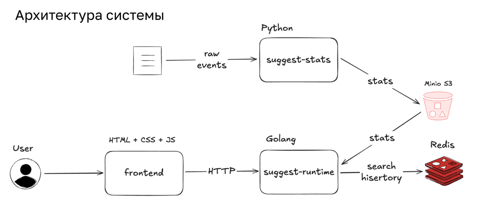
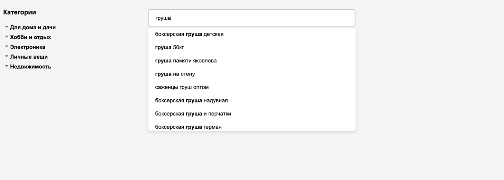

## Сервис поисковых подсказок

# Компоненты
## [frontend](frontend)

Простой сайт для тестирования и демонстрации работы сервиса

## [suggest-stats](suggest-stats)
Сервис на Python для сбора и агрегации сырых пользовательских событий

## [suggest-runtime](suggest-runtime)
Runtime сервис, обрабатывающий пользовательские запросы и возвращающий саджесты
